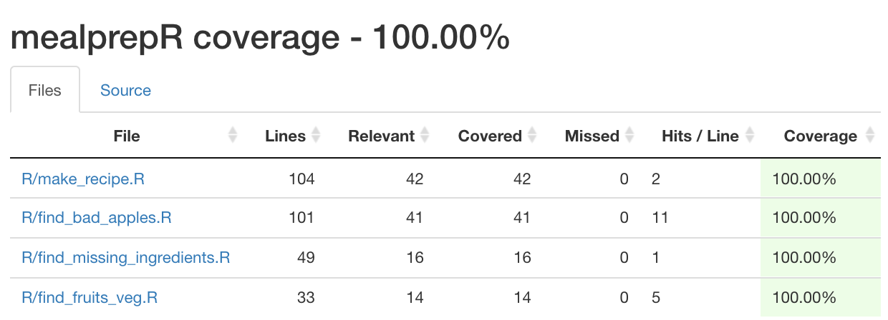

<!-- README.md is generated from README.Rmd. Please edit that file -->

# mealprepR

<!-- badges: start -->

[](https://github.com/UBC-MDS/mealprepR/actions)

[](https://codecov.io/gh/UBC-MDS/mealprepR)

<!-- badges: end -->

MealprepR offers a toolkit, made with care, to help users save time in
the data preprocessing kitchen.

## Overview

Recognizing that the preparation step of a data science project often
requires the most time and effort, `mealprepR` aims to help data science
chefs of all specialties master their recipes of analysis. This package
tackles pesky tasks such as classifying columns as categorical or
numeric ingredients, straining NA values and outliers, and automating a
preprocessing recipe pipeline.

## Functions

`find_fruits_veg()`: This function returns the indices of numeric and
categorical variables in the dataset.

`find_missing_ingredients()`: For each column with missing values, this
function will create a reference list of row indices, sum the number,
and calculate the proportion of missing values.

`find_bad_apples()`: This function uses a univariate approach to outlier
detection. For each column with outliers (values that are 2 or more
standard deviations from the mean), this function will create a
reference list of row indices with outliers, and the total number of
outliers in that column.

`make_recipe()`: This function is used to quickly apply common data
preprocessing techniques.

## Examples

### `find_fruits_veg()`

### `find_missing_ingredients()`

### `find_bad_apples()`

### `make_recipe()`

Do you find yourslef constantly applying the same data preprocessing
techniques time and time again? `make_recipe` can help by applying your
favourite preprocessing recips in only a few lines of code.

Below `make_recipe` applies the following common recipe in only one line
of code:

1.  Split data into training, validation, and testing
2.  Standardise and scale numeric features
3.  One hot encode categorical features

First load the classic `mtcars` data set.

``` r
library(dplyr)
#> 
#> Attaching package: 'dplyr'
#> The following objects are masked from 'package:stats':
#> 
#>     filter, lag
#> The following objects are masked from 'package:base':
#> 
#>     intersect, setdiff, setequal, union

X <- dplyr::as_tibble(mtcars) %>%
 mutate(
    carb = as.factor(carb),
    gear = as.factor(gear),
    vs = as.factor(vs),
    am = as.factor(am)
  )

head(X)
#> # A tibble: 6 x 11
#>     mpg   cyl  disp    hp  drat    wt  qsec vs    am    gear  carb 
#>   <dbl> <dbl> <dbl> <dbl> <dbl> <dbl> <dbl> <fct> <fct> <fct> <fct>
#> 1  21       6   160   110  3.9   2.62  16.5 0     1     4     4    
#> 2  21       6   160   110  3.9   2.88  17.0 0     1     4     4    
#> 3  22.8     4   108    93  3.85  2.32  18.6 1     1     4     1    
#> 4  21.4     6   258   110  3.08  3.22  19.4 1     0     3     1    
#> 5  18.7     8   360   175  3.15  3.44  17.0 0     0     3     2    
#> 6  18.1     6   225   105  2.76  3.46  20.2 1     0     3     1
```

``` r
library(mealprepR)
#> Loading required package: caret
#> Loading required package: lattice
#> Loading required package: ggplot2

mtcars_splits <- make_recipe(
  X = X, 
  y = "gear", 
  recipe = "ohe_and_standard_scaler", 
  splits_to_return = "train_test"
)

head(mtcars_splits$X_train)
#> # A tibble: 6 x 17
#>       mpg   cyl    disp     hp   drat      wt   qsec  vs_0  vs_1  am_0  am_1
#>     <dbl> <dbl>   <dbl>  <dbl>  <dbl>   <dbl>  <dbl> <dbl> <dbl> <dbl> <dbl>
#> 1  0.0659  0    -0.480  -0.463  0.538 -0.511  -0.781     1     0     0     1
#> 2  0.0659  0    -0.480  -0.463  0.538 -0.275  -0.474     1     0     0     1
#> 3  0.341  -1.07 -0.876  -0.701  0.447 -0.789   0.398     0     1     0     1
#> 4 -0.378   0     0.0137 -0.533 -1.54   0.267   1.28      0     1     1     0
#> 5 -0.959   1.07  1.04    1.43  -0.720  0.369  -1.12      1     0     1     0
#> 6  0.586  -1.07 -0.581  -1.14   0.155  0.0168  1.16      0     1     1     0
#> # … with 6 more variables: carb_1 <dbl>, carb_2 <dbl>, carb_3 <dbl>,
#> #   carb_4 <dbl>, carb_6 <dbl>, carb_8 <dbl>
```

## mealprepR and R’s Ecosystem

**mealprepR** complements many of the existing packages in the R
ecosystem around the theme of data preprocessing. With respect to
categorizing the columns of a dataframe by type, the base R code
`sapply(yourdataframe, class)` will produce the data types of each
column. However, there appears to be no easy way to divide the columns
into categorical and numerical groups. `find_fruits_veg()` aims to fill
this void.

In terms of missing values, the package
[na.tools](https://cran.r-project.org/web/packages/na.tools/na.tools.pdf)
provides a suite of tools to check the number and proportion of missing
values in a dataset as well as methods controlling how they may be
replaced. The
[forecast](https://cloud.r-project.org/web/packages/forecast/forecast.pdf)
package includes the function `na.interp()` which provides a similar
replacement tool for time series data. The gap between these packages is
that neither provides a summary of the missing values including the list
of indices where they occur. `find_missing_ingredients()` augments these
tools by providing a summary dataframe detailing which columns have
missing values, as well as their count and proportion.

The base R `summary()` function is a popular first function to run
during the data exploration stage of a project because it returns the
mean, median, minimum, and maximum of each variable in a dataset, which
allows users to easily see whether there are possible outliers. However,
the output of this function does not tell you which rows of data these
outliers are found in, or how many outliers are present in the
dataframe. Packages like
[outliers](https://cran.r-project.org/web/packages/outliers/outliers.pdf)
and
[OutlierDetection](https://cran.r-project.org/web/packages/OutlierDetection/OutlierDetection.pdf)
provide many more ways of detecting outliers using both univariate and
multivariate outlier detection methods, and some functions such as the
`outlierTest()` function from the
[car](https://cran.r-project.org/web/packages/car/car.pdf) package also
output the row within a dataframe which has the most extreme observation
given a model. The `find_bad_apples()` function provides more detail
than the base R `summary()` function for outlier detection, but does not
provide multivariate outlier detection like other functions from
packages specifically made to detect outliers.

Lastly, there are many great tools in the data science ecosystem for
pre-processing data such as
[caret](https://cran.r-project.org/web/packages/caret/caret.pdf) in R.
However, you may find yourself frequently writing the same lengthy code
for common preprocessing tasks (e.g scale numeric features and one hot
encode categorical features). `preprocess_recipe()` provides a *shortcut
function* to apply your favourite recipes quickly to preprocess data in
one line of code.

## Installation

You can install the released version of mealprepR from
[CRAN](https://CRAN.R-project.org) with:

``` r
install.packages("mealprepR")
```

And the development version from [GitHub](https://github.com/) with:

``` r
# install.packages("devtools")
devtools::install_github("UBC-MDS/mealprepR")
```

## Coverage

If not already installed, enter the following code into your R console:

    install.packages("covr")

Use the following to derive the test coverage results:

    library(covr)
    report()

The coverage result is shown below:


